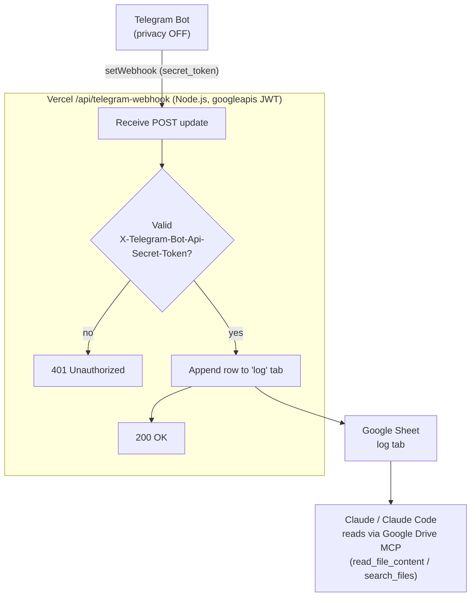

# personal-secretary

Telegram → Vercel webhook → Google Sheets log, read by Claude via the Google Drive MCP.

A Telegram bot logs every message from every chat it's currently a member of. Scope is
controlled by adding or removing the bot from a chat in Telegram itself — there's no
separate whitelist. Each message is forwarded to a Vercel serverless function, which
appends it as a row to a Google Sheet. Claude / Claude Code can then read and query
that Sheet through the Google Drive MCP whenever it needs to consult the message log.

## Architecture



## Setup

### 1. Telegram bot

1. Open [@BotFather](https://t.me/BotFather) in Telegram → `/newbot` → follow the
   prompts → copy the token into `.env` as `TELEGRAM_BOT_TOKEN`.
2. Still with BotFather: `/setprivacy` → select your bot → **Disable**.
   This lets the bot read every message in a group, not just commands addressed to it.
3. Add the bot to any chat you want logged; remove it from a chat to stop logging it.
   It only sees messages sent *after* it joins — no history backfill.

### 2. Google Cloud service account

1. Go to [console.cloud.google.com](https://console.cloud.google.com) → create a
   project (or reuse one).
2. **APIs & Services → Library** → enable **Google Sheets API**. Also enable
   **Google Drive API** if you'll browse/search the Sheet via the Drive MCP.
3. **APIs & Services → Credentials → Create Credentials → Service Account** → give it
   any name → Create.
4. Open the new service account → **Keys** tab → **Add Key → Create new key → JSON**.
   This downloads a `.json` key file. Keep it out of git (already covered by
   `.gitignore`).
5. Base64-encode the key file for the env var:
   - Git Bash / WSL: `base64 -w0 service-account.json`
   - PowerShell: `[Convert]::ToBase64String([IO.File]::ReadAllBytes("service-account.json"))`
   Paste the result into `.env` as `GOOGLE_SERVICE_ACCOUNT_JSON`.

### 3. Google Sheet

Follow [scripts/init-sheet.md](scripts/init-sheet.md): create the Sheet with a `log`
tab and headers, share the Sheet with the service account's email as **Editor**, and
copy the Sheet ID into `.env` as `SHEET_ID`.

### 4. Environment variables

Copy `.env.example` to `.env` and fill in all four values:

```
TELEGRAM_BOT_TOKEN=
TELEGRAM_WEBHOOK_SECRET=
GOOGLE_SERVICE_ACCOUNT_JSON=
SHEET_ID=
```

`TELEGRAM_WEBHOOK_SECRET` is any random string you invent (e.g.
`openssl rand -hex 24`).

### 5. Deploy to Vercel

```
npm install
vercel deploy        # or: vercel --prod
```

Then, in the Vercel project settings, add the same 4 environment variables from
`.env`, and redeploy so the function picks them up.

### 6. Register the webhook

After deploy, register the webhook once (rerun any time the deploy URL changes):

```bash
# bash / Git Bash
TELEGRAM_BOT_TOKEN=... TELEGRAM_WEBHOOK_SECRET=... \
  ./scripts/set-webhook.sh https://your-project.vercel.app
```

```powershell
# PowerShell
$env:TELEGRAM_BOT_TOKEN = "..."
$env:TELEGRAM_WEBHOOK_SECRET = "..."
.\scripts\set-webhook.ps1 -DeployUrl "https://your-project.vercel.app"
```

Both scripts print `getWebhookInfo` afterward — confirm `url` is set and there's no
`last_error_message`.

## Verifying it works end to end

1. `getWebhookInfo` (via the setup script, or directly) shows the deployed URL with no
   `last_error_message`.
2. Add the bot to a chat, send a message — it shows up as a new row in `log` within a
   few seconds.
3. Remove the bot from that chat, send another message elsewhere it isn't a member of
   — nothing gets logged (it never receives the update).
4. From Claude, use the Google Drive MCP (`search_files` to locate the Sheet, then
   `read_file_content`) to read back the log.
5. POSTing to `/api/telegram-webhook` without the secret header returns 401.

## Repo layout

| Path | Purpose |
|---|---|
| `api/telegram-webhook.js` | The serverless function handling all webhook logic |
| `lib/sheets.js` | Google Sheets client, log append |
| `scripts/set-webhook.sh` / `.ps1` | Registers the webhook with Telegram after deploy |
| `scripts/init-sheet.md` | Manual steps to create the Sheet + tab |
| `.env.example` | All required environment variables, documented |

See also [WORKSPACE_CONTEXT.md](WORKSPACE_CONTEXT.md) for the reusable pattern this
project establishes, for onboarding future chat sources (Zalo, other emails, etc.).
